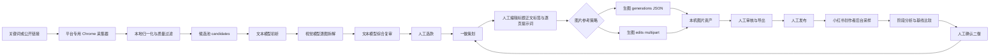

# 图文内容增长 Agent 架构与实现说明

> 适用读者：需要理解全系统、重构模块或评估交付边界的工程师
>
> 当前版本：1.4.6（内容生命周期与二做闭环版）
>
> 核验日期：2026-08-11

## 1. 系统定位

这是一个 Windows 本地、单机单实例的图文内容工作流。浏览器自动化负责在允许的公开页面读取数据，AI 适配器负责把不同供应商翻译成统一的文本、视觉、生图能力，本地服务负责状态和编排，原生 JS 工作台负责人工控制。

系统的核心取舍是“确定性工具 + 模型理解 + 人工闸门”：

- 抓取、去重、过滤、文件落盘、状态转换和停止逻辑由代码控制。
- 文本模型分析标题/正文、复审视觉结果、起草一做文案和生图提示词。
- 视觉模型逐图识别并输出结构化描述。
- 生图模型只在人工确认提示词和图片策略后调用。
- 人工负责选款、编辑、审核、发布和触发二做。

## 2. 总体数据流



抖音当前只走到公开图文抓取、分析和一做适配；其发布后数据采样节点没有接入这条图中 Q 之后的路径。

## 3. 进程和模块关系

```text
图文爆款Agent.exe / BAT
        │
        ├─ ContentOpsLauncher / Watchdog
        │       └─ runtime\node.exe server.cjs
        │                           ├─ HTTP API + 静态文件
        │                           ├─ workflow scheduler
        │                           ├─ state persistence
        │                           ├─ ai adapters
        │                           └─ collectors
        │
        └─ 浏览器打开本地工作台
                    └─ app.js → /api/state、/api/*
```

`server.cjs` 是唯一业务真相源。前端不直接读文件，采集器和 AI 适配器由后端调用。服务只绑定本机 loopback，默认端口 17851；同一状态目录通过 `server.lock.json` 防止多实例。

## 4. 前端实现

前端是无构建步骤的原生 JavaScript 单页工作台：

- `index.html`：应用骨架、导航和表单容器。
- `app.js`：`render()` 和各视图渲染函数，包括 `renderDashboard()`、`renderRuns()`、`renderRadar()`、`renderCreation()`、`renderProduced()`、`renderReview()`、`renderLoop()`、`renderEnterprise()`、`renderMaterials()`、`renderSupervisor()`、`renderSettings()`。
- `styles.css`：布局、状态颜色、响应式规则。

导航视图包含总控台、任务记录、候选与选款、图文生产、已生产内容库、发布与数据、分析与二做、企业素材库、成功素材库、值班主管、接入与设置。

页面约每 3 秒同步总控、工作流、采集、生图任务和 Agent 心跳；任务结束后后端立即持久化，避免页面残留“运行中”。按钮应以服务返回状态为准，不能仅凭前端局部变量判断完成。

## 5. 后端状态和持久化

### 默认状态

`initialState()` 生成 `settings`、`agents`、`candidates`、`variants`、`publications`、`materials`、`enterpriseProfiles`、`activeEnterpriseProfileId`、`workflowRuns`、`activity` 等字段。`settings` 包含模型档案 ID、平台开关、关键词、抓取数量、并发、预算、生图规则、二做数量、采样节点等。

### 状态转换

候选：

```text
new → selected → generated
  └────────────→ ignored
```

完成一做后，候选退出“候选与选款”视图，成品以 `variants` 进入“已生产内容库”。删除最后一个成品时，后端会把候选恢复为 `selected`，避免内容丢失。

成品：

```text
draft → pending → approved → exported → published
             └──────────────→ rejected
```

二做通过 `parentVariantId` 指向上一代，保留来源关系。图片页保存提示词、企业参考图记录、任务状态和最终文件。

### 持久化策略

默认目录 `%APPDATA%\ContentOpsAgentV2`，使用 `state.json` + `state.backup.json` 原子保存。启动时归一化旧字段和无效值；损坏时尝试备份。API Key 不进业务状态，而由当前 Windows 用户加密存储。

服务退出时会将未完成生图标记 `interrupted`；这让“重启后可以继续”成为可见状态，而不是重复发请求。业务数据、企业原图和模型档案不应放在源码或运行包里。

## 6. 工作流编排

`workflowSteps()` 产生七步：`collect`、`analyze`、`select`、`create`、`publish`、`performance`、`scale`。工作流运行记录保存触发方式、目标平台、关键词、数量、每步状态、计数、成本和错误。

自动/人工的区别：

- 人工点击抓取或运行完整工作流时，可以自动开启人工总控，但不会擅自打开 24 小时开关。
- 24 小时调度只在 `masterEnabled && workflowAutoEnabled` 时执行。
- 自动任务到选款、策划确认、生图确认、发布和二做处暂停。
- 总控停止会递增 `masterGeneration`；在途调用完成后先比对 generation，旧任务不能写回新状态。

## 7. 并发、锁和恢复

- `collectionLocks` 按小红书公开抓取、链接导入、登录检查、创作者后台和抖音操作分组，保证同一专用 Chrome 不被多个流程同时驱动。
- 分析使用有限并发（默认 3），图片页使用有限并发（默认 4）。并发不是无限线程，仍受每日预算、供应商限流和浏览器资源影响。
- 文本/视觉分析有独立自动重试，图片任务有整任务/单页超时和重试。失败写入结构化错误，供 UI 显示和人工重试。
- `imageJobLocks` 防止重复点击生成；任务状态包括 `queued`、`running`、`ready`、`partial`、`interrupted` 等。
- 看门狗通过端口级互斥和 root 证明监控当前包；后台健康检查失败时只重启自己的 Node，不会杀掉系统所有 Node。

## 8. AI 适配实现

### 统一连接档案

`textProfiles`、`visionProfiles`、`imageProfiles` 分离保存，分别由 `activeTextProfileId`、`activeVisionProfileId`、`activeImageProfileId` 选择。档案必须保存、测试成功、再激活。供应商切换不应改业务流程，只替换档案和适配器请求协议。

### 文本链

默认走 `/v1/chat/completions`，结构化输出要求 JSON。文本初析负责标题/正文、钩子、价值卖点、顾虑、可复制结构和质量信号；视觉结果汇总后再次交给文本模型综合复审；一做再由文本模型融合爆款参考、企业资料和可见的图片规则，输出可编辑标题、正文、标签和逐页提示词。

### 视觉链

支持 chat 图片输入和 `/responses`。图片 URL 必须来自平台允许的公开 CDN，不能接受任意内网或用户提供的代理地址。每图先视觉拆解，最后由文本模型复审。视觉 API 失败时保存阻塞原因，不把文本猜测标成视觉已完成。

### 生图链

工作台确认后的每页提示词原样传给生图适配器。参考图片策略由人工选择：自动使用、必须使用企业原图、不使用企业图。

`reference_generation_json` 使用 `/images/generations` JSON，请求中携带 `image` 数组；`reference_edit` 使用 `/images/edits` multipart。供应商响应可能是 `b64_json`、`base64` 或 HTTPS URL。下载 URL 时做 HTTPS、内网、大小和文件头校验，最终按真实 MIME 类型落盘。

## 9. 采集和数据分析实现

小红书和抖音公开采集都走专用 Chrome、人工登录和低频浏览器读取，不绕验证码。采集器把页面数据归一化成候选，后端再做平台、图文类型、相关性、互动和详情完整性过滤。

小红书创作者后台读取“数据看板 → 内容分析 → 笔记数据”可见表格。发布登记包含链接和实际发布时间；匹配优先笔记 ID，再使用标题+时间。后台数据保存不可覆盖快照，默认 2/24/72 小时观察；同标题歧义和未入表内容拒绝自动写错。

## 10. API 边界

后端路由按模型、总控/工作流、采集、候选/一做、企业库、发布/二做、运维分组。路由清单以 `TECHNICAL_HANDOFF.md` 为准。API 的共同约定是：

- 输入在服务端校验并限制长度、数量和路径。
- 成功后返回当前对象或摘要，错误返回可读原因和可恢复动作。
- 需要模型、登录、人工确认或平台能力时明确阻塞，不隐式降级。
- 写状态前检查总控 generation、任务锁和当前对象仍存在。

## 11. 安全和合规边界

- 服务默认只监听 `127.0.0.1`。
- Key 只在本机加密保存，不进入前端状态和文档。
- 生图/视觉下载 URL 有 allow-list、HTTPS、内网拒绝、大小和 MIME 检查。
- 平台验证码、登录保护和服务条款不能绕过；采集仅针对允许读取的公开页面和企业自有后台。
- 导出企业库时复制素材文件和清单，不暴露本机绝对业务路径。

## 12. 可验证范围和后续边界

已验证的本地范围包括状态隔离、模型档案、企业图片库、参考图 generations JSON、图片生命周期、总控停止、看门狗、恢复和 1.4.6 内容生命周期。真实平台页面会随平台变化，必须在目标账号上做小样本验收。

抖音真人页面、抖音 24 小时压力和抖音创作者后台二次分析不在当前已验收范围。后续接入时应新增独立 collector、登录/页面夹具、匹配规则、采样节点和能力开关，不能复制小红书后台适配后直接打开。
